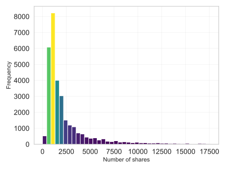
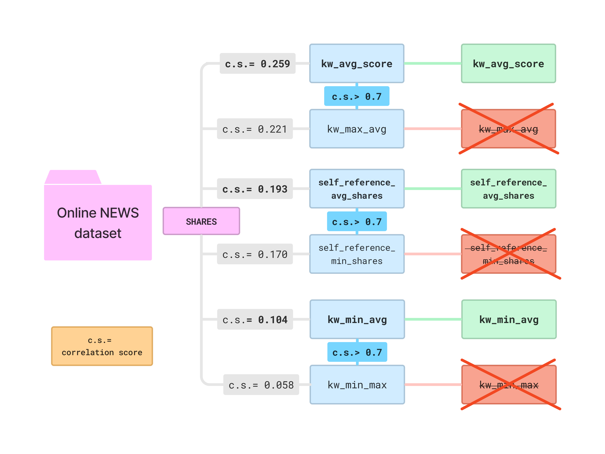

# Data Science lab - ONLINE NEWS SHARING PREDICTION
This is a project of the Data Science Lab's course of the Polytechnic of Turin. The goal is to predict the number of shares of each described news article.

# Predicting Online News Sharing

## Abstract

This project focuses on developing a regression model to predict the popularity of online news articles in terms of shares. The objective is to improve the accuracy of the model by employing advanced data preprocessing techniques and feature selection. By utilizing high-performance algorithms, the model can effectively handle large datasets and ensure accurate predictions. The comprehensive analysis of multiple features provides valuable insights into the factors influencing online news popularity, thus enhancing the accuracy of the predictions.

## Problem Overview

In the digital age, news consumption and sharing play a crucial role in people's daily lives. The dataset for this project is obtained from the Mashable website and comprises various features, including the target variable `shares`, which represents the number of shares for each news article. The goal is to predict the number of shares for a given news article based on its features.

However, with 50 features in the dataset, feature selection becomes essential to focus on the most informative and relevant attributes for accurate prediction. Some features are non-predictive or contain missing values, and categorical features require special consideration during regression analysis.

## Proposed Approach

The project follows a thorough data preprocessing process to handle outliers, missing values, and feature selection. Outliers in the `shares` feature are removed using robust techniques to improve the model's convergence and prediction accuracy. Non-predictive features, like `id` and `url`, are dropped from the dataset, and missing values in certain features are imputed or filled with zeros.

To address skewed distributions and non-bell-shaped patterns, log transformations are applied to certain features. Correlation analysis is employed to identify strongly correlated features, and one feature from each correlated pair is removed to improve the model's predictive performance.

The models considered for this regression task include Linear Regression, Support Vector Regression (with polynomial and radial basis function kernels), Random Forest Regressor, and Gradient Boosting Regressor. Hyperparameter tuning using Grid Search with cross-validation is performed for the best models.

## Results

After extensive experimentation, the Random Forest Regressor with hyperparameters `n_estimators=300`, `max_depth=35`, and `min_samples_split=2` yielded the most optimal results. The feature selection and preprocessing techniques significantly improved the model's performance, outperforming the baseline.

## Discussion

Data preprocessing is crucial in handling high-dimensional datasets and improving model performance. The presented techniques and approaches have shown promising results in predicting online news popularity. However, further investigation and feature analysis can lead to even more significant improvements. Integration of deep neural networks could also enhance the task by capturing complex patterns and relationships in the data.

The code and materials used for this project are available in the [GitHub repository](https://github.com/micolrosini/Data-Science-Lab). Feel free to explore and collaborate!
